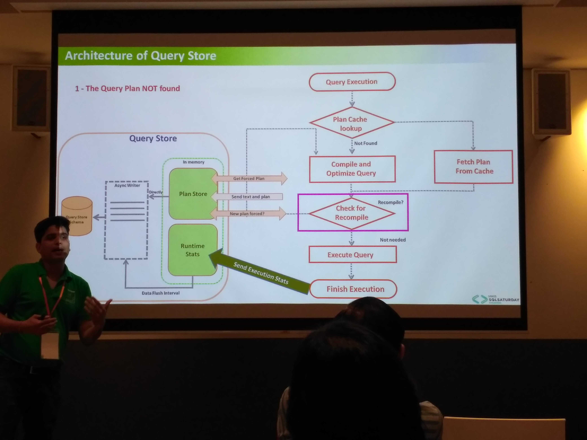
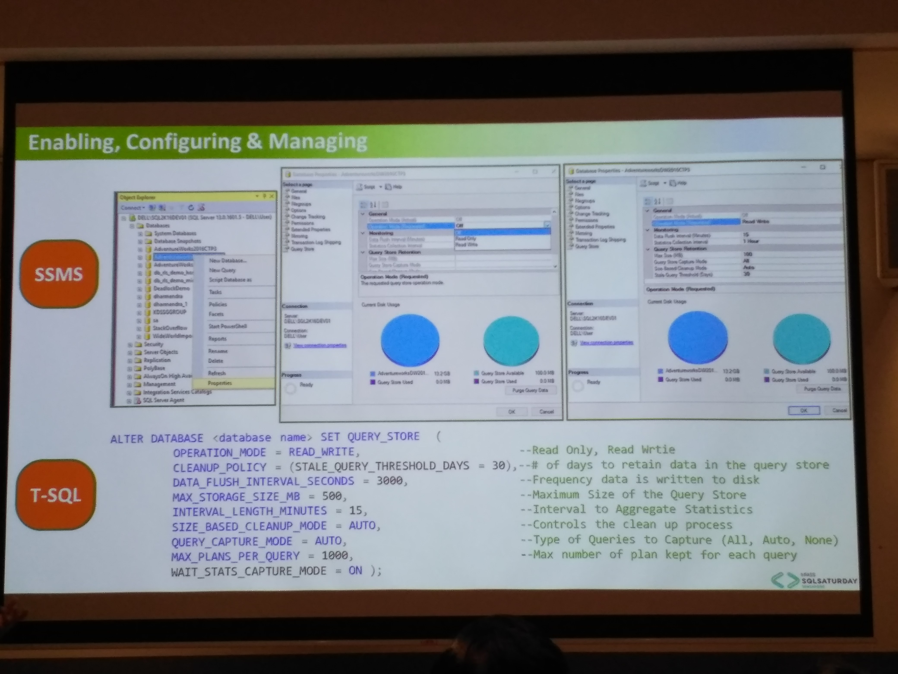

This was my first SQLSaturday and my first ever TechTalk event, it was worth the time to be honest. The speakers were amazing and the sessions were interactive and informative.

So, the first session was about **What does it take to become Data Scientist**. The speaker *Mani* did a good job and went over **R language** and what should one do if he\she aspires to go into data science field.

The second session was on **CCI (Clustered Column Index) and improvements in SQLServer2016**, this session was interesting and the most important take away was that the DataLoad in SQLServer 2016 should be done in **BatchMode with row size more then 102400**. 102400 is the magic number here. Also, the speaker stressed on the point that always target the compressed RG (row-group) first, before going into DeltaRowGroup.

This was followed by a session on **Microsoft Azure's COSMOS DB**. I have some details below.

The next speaker was from DevOps area, he spoke about how can we automate our build process and **use Azure services to achieve an end-2-end automation from code check-in to build release on UAT server**.

The last session was on **QueryStore, the latest feature in SQLServer2016**. the session was interactive, but I really did not understand the purpose of this new feature. This was a bit like, selling out stuff in new package.
You can find the details below.

## Microsoft Azure's COSMOS DB

### What is COSMOS DB
COSMOS DB is a multi-design and multi-model database, it is *essentially* saying that it is one stop shop for all kind of No-SQL databases. When configuring, one has to specify the type of db modelling required i.e Graph, KeyValue or Document based on application requirement. Currently, we can classify NoSQL database into following categories

* KeyValue DB (Other products in Market => [Redis DB](https://redis.io/))
* Document DB (Other products => [Mongo DB](https://www.mongodb.com/))
* Graph DB (Other Products => [Neo4J](https://neo4j.com/))
* ColumnStore DB (Other Products in Market => [Cassendra](http://cassandra.apache.org/))

### How can I consume Cosmos DB in my application.
Cosmos DB is exposed as an API from Azure platform, so you can programme the application to these API's.

### What is required to create your first Cosmos Graph DB
You just need a MSDN account. Yes, you heard it right, that is it. Login to Microsoft Azure [Portal](https://portal.azure.com) and start playing with Cosmos DB. Most importantly you will get *free* 200 credit points, which you can use to host a service (Cosmos DB)

### Why do I care, when I have inhouse get inhouse solution from other products
Microsoft Azure COSMOS DB provides you with many features, one of them being on-demand replication.
What do I mean by on-demand replication. So I have to setup my application from different region, then setting up
an inhouse solution will be *cost* and *time* inefficient. Microsoft Azure provides you infrastruture through out the world. So you can connect to your nearest data-center replicate your services\db.

## QueryStore (More to come on this)

### What is Query Store
This is a brand new feature introdcued with SQLServer 2016. This is optional feature that can be turned on to monitor the database performance.

MSDN Link for further
[Query Store](https://blogs.msdn.microsoft.com/mvpawardprogram/2016/03/29/sql-server-2016-query-store/)

QueryStore is created in **main mdf** file. It persists the Execution Plan and Query Metrices. 

### How does it work

### How to configure query store for your database
